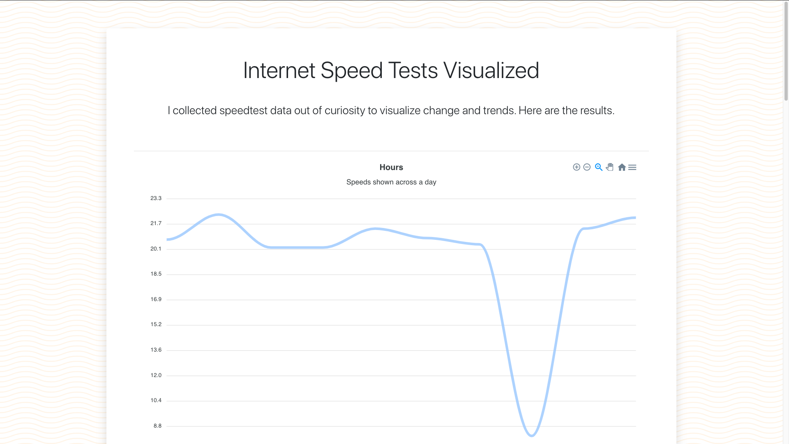

# Internet Speed Tests Visualized

## Motivation

Mostly curiosity about how my home internet speed varies throughout the hours, days, weeks, months.

## Description

The project is split into five Docker containers:

- Python scraper, to collect the data
- Backend Express.js server
- Frontend React.js
- Redis caching server
- MongoDB database

---
[](https://drone.gordon-pn.com/gordonpn/internet-speedtests-visualized)
[](https://speed.gordon-pn.com)


[](https://www.buymeacoffee.com/gordonpn)

## Built with / technologies

- Python: script in a Docker container to periodically scrape data
- Node.js and Express.js for the API endpoints
- React.js and Bootstrap CSS framework to build the front-end
  - ApexChart.js: charts library
- Docker and Docker-Compose
- Redis cache server
- NGINX

## Screenshot



## Getting started

### Prerequisites

- Python3
- Node.js
- Docker and docker-compose

### Installing

1. Clone the repo
2. Install the Python requirements and Node dependencies

````sh
cd ./scraper && pip install -r requirements.txt
cd ./backend && npm install
cd ./frontend && npm install
````

### Configuration

### Usage

To run the backend for development purposes:

```sh
cd ./backend && npm run dev
```

To run the frontend for development purposes:

```sh
cd ./frontend && npm run start
```

Start the whole stack using docker-compose:

```sh
docker-compose -f docker-compose.yml -f docker-compose.dev.yml up --build
```

#### Use cases

Data scraping can be automated through any cron-like environment on server of some sort.

## Roadmap / Todo

Check out the [open issues](https://github.com/gordonpn/isp-speed-expectation-vs-reality/issues?q=is%3Aissue+is%3Aopen+sort%3Aupdated-desc) for ideas and features I have planned!

## Authors

Myself [@gordonpn](https://github.com/gordonpn)

## License

[MIT License](./LICENSE)
